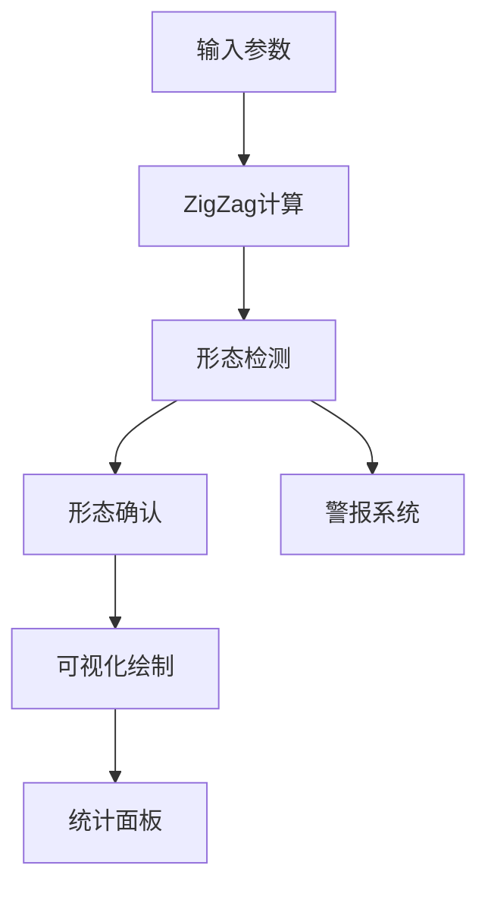
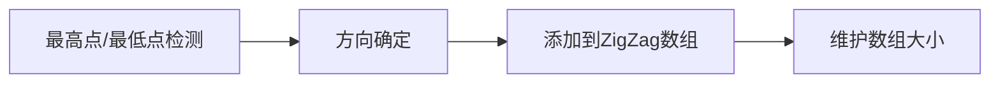
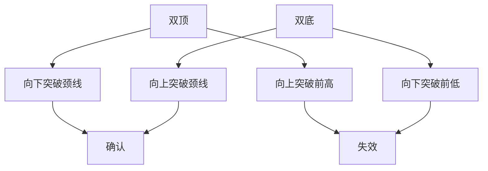
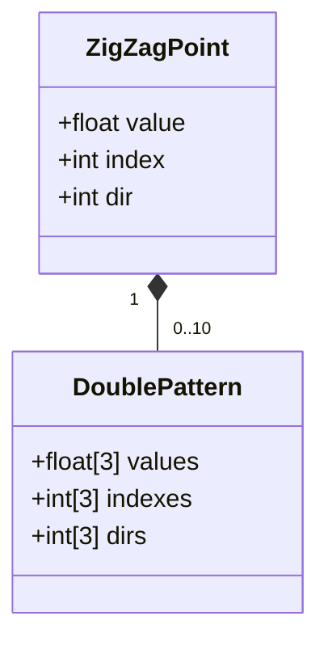

# 双顶/双底指标（Ultimate OS）实现逻辑文档



## 1. 概述
本指标用于检测金融市场中的双顶（看跌反转形态）和双底（看涨反转形态）模式。主要功能包括：
- 实时检测潜在的双顶/双底形态
- 提供形态确认和失效信号
- 可视化展示形态结构
- 统计历史形态表现
- 生成交易警报

## 2. 输入参数
```pine
length = input(10, step=5, minval=5)               // 枢轴点检测周期
showZigzag = input(false)                          // 是否显示ZigZag线
showPivots = input(true)                           // 是否显示枢轴点标签
showStats = input(true)                            // 是否显示统计面板
bullishColor = input(color.green)                  // 看涨颜色
bullTrapColor = input(color.orange)                // 多头陷阱颜色
bearishColor = input(color.red)                    // 看跌颜色
bearTrapColor = input(color.lime)                  // 空头陷阱颜色
textColor = input(color.black)                     // 文本颜色
MaxRiskPerReward = input(30)                       // 最大风险回报比阈值
DisplayRiskPerReward = input(true)                 // 是否显示风险回报比
```

## 3. 核心算法

### 3.1 ZigZag计算


- **枢轴点检测**：使用`highestbars()`和`lowestbars()`识别周期内的高低点
- **方向跟踪**：记录当前市场方向（1=上涨，-1=下跌）
- **数组管理**：维护三个数组存储ZigZag点：
  - `zigzagvalues`：价格值
  - `zigzagindexes`：K线索引位置
  - `zigzagdir`：方向标记（2=更高高点，1=更低高点，-1=更高低点，-2=更低低点）

### 3.2 双顶/双底检测
```pine
检测条件：
双顶：高-低-高序列 + 风险回报比 < 阈值
    ZigZag序列：高点(2) → 低点(负值) → 高点(1)
双底：低-高-低序列 + 风险回报比 < 阈值
    ZigZag序列：低点(-2) → 高点(正值) → 低点(-1)
```

- **风险回报比计算**：
  ```pine
  risk = |当前高点 - 前低点|
  reward = |当前高点 - 中间低点|
  riskPerReward = risk/(risk+reward)*100
  ```

### 3.3 形态确认


- **双顶确认**：价格跌破中间低点（颈线）
- **双底确认**：价格升破中间高点（颈线）
- **形态失效**：价格突破初始高点（双顶）或初始低点（双底）

## 4. 可视化系统

### 4.1 形态绘制
- **实线**：连接形态起点和终点（关键支撑/阻力）
- **虚线**：
  - 颈线（水平）
  - 突破线（实时延伸）
- **标签**：显示形态类型和风险回报比

### 4.2 枢轴点标记
- **HH**：更高高点（绿色）
- **LH**：更低高点（橙色）
- **HL**：更高低点（红色）
- **LL**：更低低点（青色）

### 4.3 统计面板


显示以下统计数据：
- 双顶/双底出现次数
- 确认/失效次数
- 确认率（颜色编码）：
  - ≥80%：绿色
  - 60-79%：浅绿
  - 40-59%：黄色
  - 20-39%：橙色
  - <20%：红色

## 5. 警报系统
```pine
alertcondition(doubleBottom, "双底形态", "检测到潜在双底形态")
alertcondition(doubleBottomConfirmation>0, "双底确认", "价格突破颈线")
alertcondition(doubleBottomConfirmation<0, "双底失效", "价格突破前低")
alertcondition(doubleTop, "双顶形态", "检测到潜在双顶形态")
alertcondition(doubleTopConfirmation>0, "双顶确认", "价格突破颈线")
alertcondition(doubleTopConfirmation<0, "双顶失效", "价格突破前高")
```

## 6. 核心数据结构


- **ZigZag数组**：存储最近的10个关键转折点
- **形态数组**：存储当前检测到的形态的三个关键点（起点、颈线点、终点）

## 7. 处理流程
```mermaid
sequenceDiagram
    每个K线->>ZigZag计算: 更新高低点
    ZigZag计算->>形态检测: 传递ZigZag点
    形态检测->>形态确认: 发现潜在形态
    形态确认->>可视化: 绘制形态
    形态确认->>统计面板: 更新计数
    形态确认->>警报系统: 触发警报
